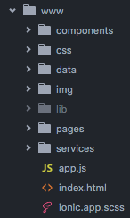

# Contribuindo

Todo o código do Code For Floripa é open source e qualquer um pode contribuir.

## Contribuindo com ideias ou identificação de bugs

Se você tem alguma ideia ou encontrou algum bug, mas não sabe programar, **[crie uma issue](https://github.com/CodeForFloripa/dicionariomanezes/issues)**.

## Contribuindo com programação

Se você quer contribuir colocando a mão na massa, mas ainda não sabe programar, preparamos uma [lista de recursos interessantes](RESOURCES.md), além de alguns [tutorias simples](TUTORIAL.md)

### Instalando NodeJS/ionic

1. Instale o [Node Version Manager](https://github.com/creationix/nvm)
2. Instale a última versão do node **5.x**
3. Instale ionic: `npm install -g ionic`

### Baixando e configurando o projeto

1. Acesse [O site do repositório](https://github.com/CodeForFloripa/dicionariomanezes)
2. Clique em `fork` para criar um fork do repositório para o seu usuário
3. Clone seu projeto `git clone https://github.com/**SEUUSUARIO**/dicionariomanezes.git`
4. Entre na pasta para onde o projeto foi clonado: `cd dicionariomanezes`
5. Adicione como o repositório original como `upstream`, para que possamos manter sincronia entre eles: `git remote add upstream https://github.com/CodeForFloripa/dicionariomanezes.git`
2. `cd app`
3. `npm install -g ionic gulp bower`
4. `npm install`
5. `bower install`
6. `ionic serve` Isso deve abrir uma janela no browser com o app
7. Se quiser rodar no device: `ionic run android --device`

### Sincronizando com o repositório original

Antes de submeter sua alteração para aprovação, é obrigatório sincronizar o seu repositório com o repositório original. Para isso, basta seguir os seguintes passos (Retirados [daqui](https://help.github.com/articles/syncing-a-fork/)):

1. Adicione a referência ao `upstream`, como mostrado acima.
2. Atualize sua versão do repo original: `git fetch upstream`
3. Selecione a sua branch development `git checkout dev`
4. Sincronize `git merge upstream/dev`

> Nota: No desenvolvimento, usaremos apenas a branch development. A branch master contém a versão do aplicativo em produção.

### Criando um Pull Request

Para manter consitência e qualidade do código, adotamos o uso de Pull-Requests. Após ter finalizado suas modificações, solucionado o problema de uma das issues e atualizado o seu repositório para que contenha todas as mudanças que ocorreram no master, você pode criar um Pull Request para que analizemos as modificações e adicionemos o código ao repositório:

1. Acesse [O site do repositório](https://github.com/CodeForFloripa/dicionariomanezes)
2. Clique em `Pull Request`
3. Clique em `New Pull Request`
4. Clique em `Compare Across Forks`
5. Em `head fork`, selecione o seu fork do projeto, e a branch dev
6. Clique em `Create Pull Request`
7. Nos comentários, identifique a qual issue esse pull request pertence (caso exista)

> **IMPORTANTE** caso hajo conflito de merge, o PR não será analizado. É obrigatório sincronizar o seu fork com o repo original antes de criar o pull request.

### Estrutura da aplicação

No CodeForFloripa, dividimos as partes de nossa aplicação em 3 tipos: `Services`, `Components` e `Pages`.

* *Services*: Funcionalidades sem interface, que rodam no background (acesso ao banco de dados, lógica de negócios, servidor)
* *Pages*: Páginas da aplicação
* *Components*: Elementos da interface que compõem a página (um botão especial, uma lista, etc).

Cada um desses elementos fica localizado em sua pasta específica, dentro da pasta `www`. Ignore as outras pastas do projeto, a pasta `www` é a única pasta que importa para o desenvolvimento.

* `components`: Pasta onde ficam localizados os componentes do app. Cada componente possui sua pasta separada, que inclui um javascript e possivelmente um html e um css.
* `css`: Ignore essa pasta (Leia abaixo)
* `data`: Pasta onde ficam os dados usados pela aplicação (json, csv, etc..)
* `img`: Imagens usadas no app. OBS: Caso a imagem seja utilizada apenas por um componente ou página, ela pode ser colocada na pasta desse componente ou página.
* `pages`: Diretório onde ficam as páginas do app. Assim como componentes, cada página possui sua pasta onde fica o seu `js`, `html`, `css` e talvez imagens.
* `services`: Diretório para os serviços. Cada serviço tem sua própria pasta.
* `app.js`: Arquivo root para nossa aplicação, que cria o app em si. Aqui definimos configurações globais para o app, bem como as rotas para as páginas.
* `index.html`: Página inicial da aplicação.
* `ionic.app.css`: Estilo raiz da aplicação. Aqui definimos estilos que afetam todo o app (paleta de cores por exemplo) e quais scss queremos incluir no css final.

**IMPORTANTE**
> Nunca edite o conteúdo da pasta `css`. Todos os estilos devem ser definidos em seus específicos arquivos `scss`. Os arquivos css serão gerados automaticamente.

#### Styleguide

Para manter consistência de código, estipulamos algumas regras:

1. Programar usando variáveis em inglês.
2. Seguir SEMPRE a estrutura definida acima.
3. Use espaços, não TAB.

### Sugestões para contribuições a serem implementadas
- [ ] [Fonética dos  verbetes](https://pt.m.wikipedia.org/wiki/Alfabeto_fon%C3%A9tico_internacional)
- [ ] Áudio dos verbetes
- [ ] Jogos
- [ ] Cartões de Memorização
- [ ] Categorização de verbetes
- [ ] Melhorias de design
- [ ] Sugestão de novos verbetes por parte de usuários
- [ ] Favoritar verbetes
- [ ] .....
